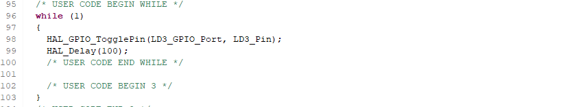
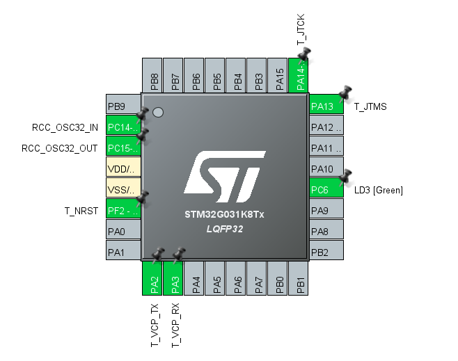

# 01.1_blinky
## 개요
* GPIO 출력을 사용해 LED를 켜고 끌 수 있다.
* 지정한 시간 동안 멈출 수 있는 delay 기능.

## 주요 파일

> Core/Src/main.c

* HAL_GPIO_TogglePin()
    * GPIO 출력으로 설정된 핀의 상태를 반대로 바꾼다. Low 였다면 High로, High였다면 Low로
    * LD3_GPIO_Port, LD3_Pin
        * STM32CubeMX에서 설정한 GPIO 포트와 핀 번호. LED에 연결되어 있음.
        * NUCLEO_G031K8에서는 PC6(GPIOC, Pin 6)에 연결되어 있다.
        * 

* HAL_Delay()
    * 지정된 시간 만큼 멈춤. 시간은 ms 단위로 지정
