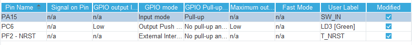

# 01.2_blinky_dual
## 개요
* 01.1_blinky의 모든 기능 더하기...
* GPIO를 통해 스위치 상태를 읽어 LED 점멸 속도에 변화를 준다.

## 회로 구성

* PA15는 Nucleo 보드의 D2 핀에 연결되어 있다. 바로 옆의 GND 핀과 D2 핀 사이에 스위치를 연결하고 스위치를 on 시키면 PA15 핀에 Low가 입력된다. 반대로 스위치를 off 시키면 PA15에 High가 입력되도록 PA15를 pull-up으로 설정한다.

## 주요 파일

> Core/Src/main.c

* CubeMX 설정
    * 
    * PA15를 GPIO Input, pull-up으로 설정.
    * User Label에 SW_IN 입력.
* 변수 선언
    * 
* Loop
    * 
    * HAL_GPIO_ReadPin()
        * GPIO 입력으로 설정된 핀의 상태(H/L)를 읽는다.
