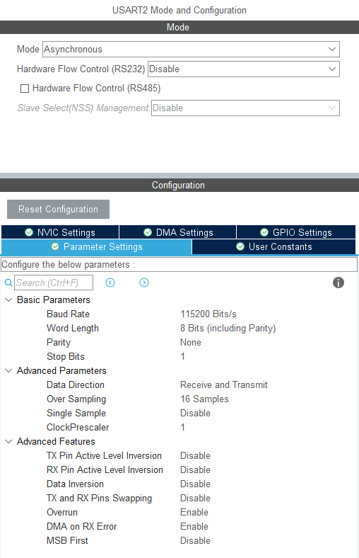

# 05.1_UART_TX
## 개요
* UART를 이용해 메시지를 전송(TX)한다.
* `printf()`를 활용한다.

## 회로 구성
* 
* NUCLEO-G031K8 보드에서 STM32의 USART2가 내장 ST-Link를 통해 USB로 연결되어 PC에 가상 시리얼 포트로 구성된다.
* 본 예제는 추가 회로가 필요하지 않다.

## 주요 파일

> Core/Src/main.c

* CubeMX 설정
    * 
    * USART2를 115200bps, 8 bit width, No parity로 설정한다.
* 변수 선언
    * 
* Loop
    * 
    * `HAL_UART_Transmit()`
        * UART를 통해 문자열을 송신한다
        * 모든 문자열 송신이 마 마무리될 때 까지 리턴하지 않는다.
        * 115200 bps로 10글자를 송신하려면 약 0.87ms 걸린다.
    * 이 예제에서는 100ms의 delay와 약 15바이트 전송을 위한 1.3ms 시간지연이 더해셔 약 101.3ms 주기로 LED가 깜박이게 된다. 송신하는 메시지 길이에 따라 시간 지연도 변한다.
    