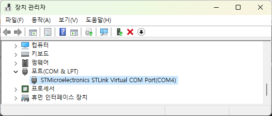
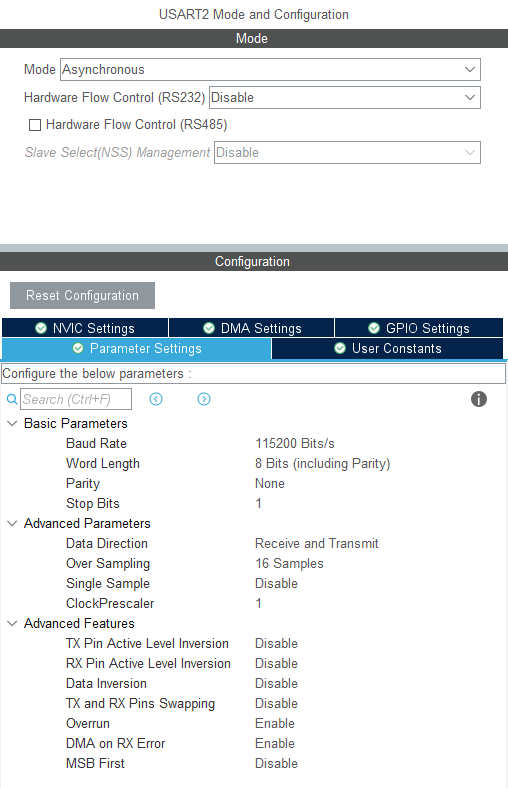
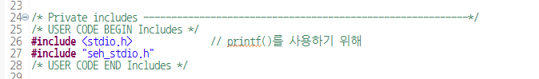
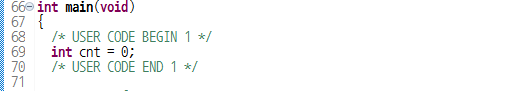
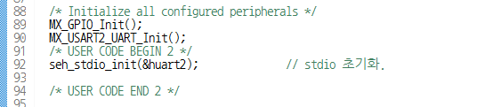
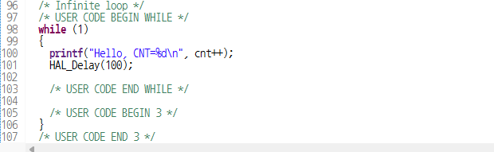

# 05.5_stdio
## 개요
* `printf()`를 활용한다.
* stdio를 사용해 UART로 출력한다.

## 회로 구성
* 
* NUCLEO-G031K8 보드에서 STM32의 USART2가 내장 ST-Link를 통해 USB로 연결되어 PC에 가상 시리얼 포트로 구성된다.
* 본 예제는 추가 회로가 필요하지 않다.

## 주요 파일

> Core/Src/main.c

* CubeMX 설정
    * 
    * USART2를 115200bps, 8 bit width, No parity로 설정한다.
* #include
    *     
* 변수 선언
    * 
* stdio 초기화
    * 
    * `huart2`를 사용해 seh_stdio를 초기화한다.
* Loop
    * 
    * `printf()`
        * 문자열 출력은 `huart2`를 통해 한바이트씩 진행된다.
        * UART를 통해 문자열을 송신한다
        * 모든 문자열 송신이 마무리될 때 까지 리턴하지 않는다.
    