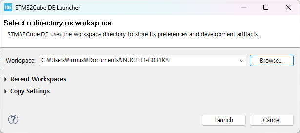

# NUCLEO-G031K8 예제 모음

1. Intro
    * [01.1_blinky](01.1_blinky/README.md) : GPIO 출력, Delay 기능 사용한 LED 깜박이기
    * [01.2_blinky_dual](01.2_blinky_dual/README.md) : GPIO 입력. 스위치 상태에 따라 다른 속도로 LED 깜박이기
1. TBD
1. TBD
1. TBD
1. UART
    * [05.1_UART_TX](05.1_UART_TX/README.md) : UART 송신. `printf()`
    * [05.5_stdio](05.5_stdio/README.md) : UART를 사용한 standard IO redirection. `printf()`를 손쉽게 사용한다.

# STM32CubeIDE에서 활용하기
1. Repository를 clone 받는다. 
1. STM32CubeIDE에서 File -> Switch Workspace -> Other... 선택
1. Browse 버튼 클릭 후 clone 받은 폴더를 선택해 Launch

1. Information Center 탭을 닫는다.

1. File -> Open Projects from File System... 선택. Import source에서 Directory 클릭 후 clone 받은 폴더를 선택한다.

1. Finish 클릭하면 예제 프로젝트들이 workspace상에 import 되다.

> Tip. 빌드 하고 싶은 프로젝트를 제외한 나머지 들은 Close Project 해 두면 편리