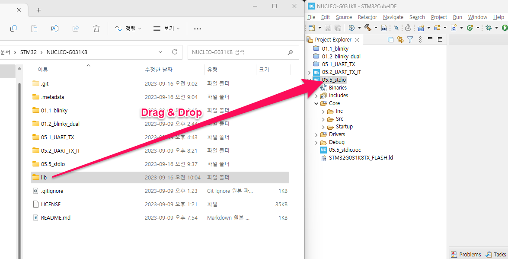
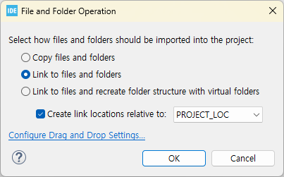
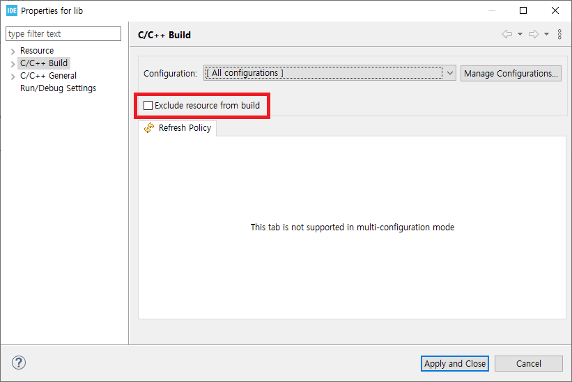

# SEH
STM32 Extended HAL

Copyright : irmusy@gmail.com

## How To Use
1. Link ```lib``` directory into user project.



1. Right-click on ```lib``` in Project Explorer, then select ```Properties```
1. Uncheck ```Exclude resource from build```


1. Right-click on ```lib``` in Project Explorer, then select ```Add/remove include path...```
1. Check for ```Debug``` and ```Release```

---

## Libraries
### seh_stdio
Helper function for standard I/O. If user calls printf(), this library redirects formatted texts into UART peripheral. User must provide properlly initialized UART peripheral handle, and this can be done using CubeMX.

#### Prublic Functions
##### void seh_stdio_init(UART_HandleTypeDef *huart)
Library initializer. Must be called before use of printf().

#### Related Projects
* https://github.com/irmus/NUCLEO-STM32G431KB/tree/main/02.1.printf_uart
* https://github.com/irmus/NUCLEO-G031K8/tree.main/05.5.stdio
